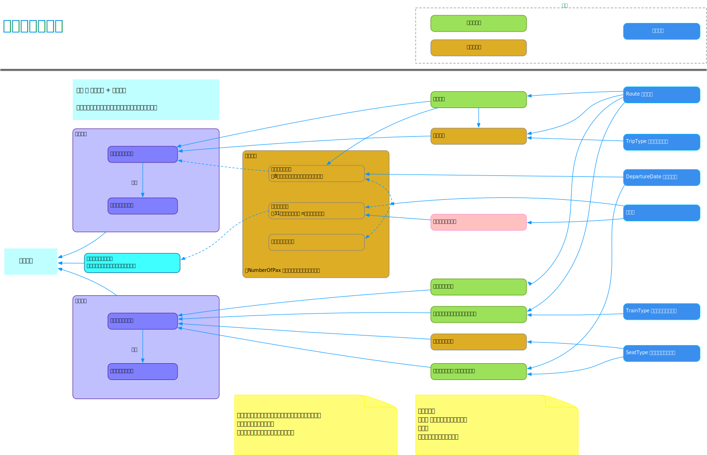
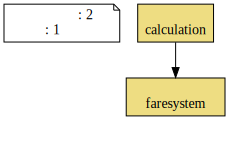
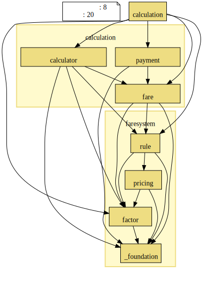
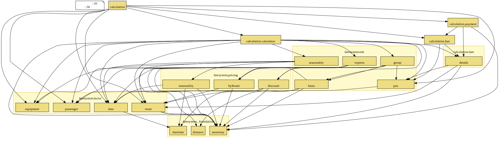
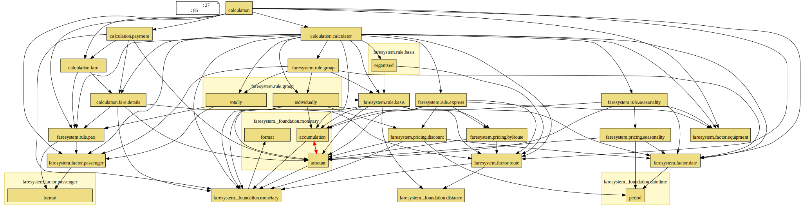

# jr-pricing in Kotlin


[]()


## Table of Contents

* [**What is This ?**](#seedling-what-is-this-)
* [**実行方法**](#seedling-実行方法)
* [**設計の過程**](#seedling-設計の過程)
* [**モデルの説明**](#seedling-モデルの説明)
* [**ビジネスルールの実装箇所**](#seedling-ビジネスルールの実装箇所)
* [**テスト**](#seedling-テスト)
* [**探検方法**](#seedling-探検方法)
* [**おことわり**](#seedling-おことわり)

---

## :seedling: What is This ?

[masuda220/jr-pricing 「JR 新幹線　料金ルールを実装してみよう」](https://github.com/masuda220/jr-pricing)  
を Kotlin で実装してみたものです。


## :seedling: 実行方法

実行結果を確認するために、便宜的に Swagger UI を使用しています。

* bootRun で実行
* localhost:50222 で Swagger UI 画面が表示されます
* 画面の案内に従って実行してください


## :seedling: 設計の過程

大まかな運賃計算の流れを下図のとおり整理してみました。  

右側に運賃を決定づける因子があり、  
左の方へ計算が流れていくイメージ。  

---

---

### :leaves: 整理できたところ
* 運賃が定まる元になる __運賃因子__ との関連
* 料金には、__加算系と減算系__ がある  
  → のちに、`accumulate`パッケージへと発展
* 団体総合割引では「n人無料扱い」となるので、__運賃計算上の乗客数__ というのが必要になりそう

### :leaves: 難しそうなところ
* 団体割引は下記の2通りあり、__適用先が異なる__
  * 普通運賃から割り引くもの
  * 乗客のうち何人かが無料扱いになる

### :leaves: 悩みそうなところ
* 往復割引きは、Route自身も使うけど Routeから導出された普通運賃も使うところ


## :seedling: モデルの説明

このセクションのモデル画像は
[dddjava/jig](https://github.com/dddjava/Jig) により生成されたものです。 

出力に必要な環境は [こちら](https://github.com/dddjava/Jig#%E4%BD%BF%E3%81%84%E6%96%B9) を参照ください。  

IntelliJ IDEA であれば Gradle ツールウィンドウで `jigReports`タスクを実行するか、  
あるいは、下記コマンドで生成できます。

```
$ ./gradlew clean build jig
```

`build/jig/` 配下に出力されます。

### JIG の効用

JIG を使うと、  
モジュール（DDDの文脈では C# の名前空間や Java のパッケージのこと）間の依存関係を把握することができます。  
モジュール分割と依存関係を意識した設計を強制（矯正）されるような気がします。  

このセクションで提示しているダイアグラム以外にも様々なダイアグラムや表などが出力されます。  
[ここにサンプルあり](https://dddjava.github.io/jig/)  
[より詳しい説明は Wiki へ](https://github.com/dddjava/jig/wiki)  

---

### :leaves: パッケージ関連図

#### :palm_tree: domain/model/ の階層
<details open>
    <summary>パッケージ関連図 A</summary>
      
</details>

---
#### :palm_tree: domain/model/ の階層 + 1
<details open>
    <summary>パッケージ関連図 B</summary>
      
</details>

---

#### :palm_tree: domain/model/ の階層 + 2
<details open>
    <summary>パッケージ関連図 C</summary>
      
</details>

---

大きく、
* faresystem （運賃システム）パッケージ
* calculation （運賃計算）パッケージ

に分けて、運賃システムを使って運賃計算をするかたちにしています。

#### :herb: faresystem （運賃システム）パッケージ

`faresystem` （運賃システム）パッケージの構成は次の表の通り。

| パッケージ  |                    内容                    |
| ----------- | ------------------------------------------ |
| _foundation | 金額、日付、距離などの土台となる型         |
| factor      | 運賃計算のファクターとなるもの             |
| pricing     | 価格設定                                   |
| rule        | ファクターと価格設定を用いた運賃計算ルール |


#### :herb: calculation （運賃計算）パッケージ

`calculation` （運賃計算）パッケージで運賃計算をとりまとめている中心は次の2つです。

* `BasicFareCalculator`  
  * ファクターから普通運賃計算に必要な料金を導出
  * それらを累算して普通運賃を算出

* `ExpressFareCalculator`
  * ファクターから特急料金計算に必要な料金を導出
  * それらを累算して特急料金を算出


`calculation` （運賃計算）パッケージからは、  
`faresystem` （運賃システム）の `pricing`パッケージを直接は使っていないところはポイントかもしれません。


##### :palm_tree: 運賃計算のからくり

`BasicFareCalculator` や `ExpressFareCalculator` で導出といっているところは、  
実際には faresystem （運賃システム）の `rule`パッケージの運賃型を生成しています。  
`rule`パッケージの運賃型は `AccumulatableAmount` に準拠していて、  
`AccumulatableAmount`は、`accumulateAmount`関数を使って累算ができるようになっています。  
料金には「加算系」と「減算系」があり、  
どちらに準拠している料金かにより、加算／減算 されるしくみにしています。  

詳しくは、  
`accumulation`パッケージにあるクラスの説明を参照してください。


### :leaves: 相互参照が...



「累算」パッケージと「金額」パッケージ間で相互参照が発生しています。  
ただ、ここは特に問題ないと思っています。  
（何か問題がありそうなら教えてください）  

* つぶやき  
  `accumulation`パッケージと `amount`パッケージを1つのパッケージにまとめると解消できるし、  
  そうすると相互参照NGというのはある程度の目安という感じになるのかなと...  
  パッケージを分けるほどにパッケージ間相互参照は発生する可能性高くなりそう...  
  まぁ、パッケージ1つだとパッケージ相互参照しないのでそういうことか...


## :seedling: ビジネスルールの実装箇所

ふと思い立って、  
ビジネスルールを実装している箇所に `BIZ-RULE:` でマークしてみました。  
IntelliJ IDEA であれば、`⌘ + shift + F` で検索してみてください。

ほとんどは、`rule`パッケージに書かれているようです。  
`pricing`パッケージなどとも協調していますけれども。

ほぼほぼ、  
「ビジネスルールを確認したい場合は、`rule`パッケージまわりをみて、  
　具体的な価格設定については、`pricing`パッケージをみていけばいい」  
という構成になっていそうです。

ただ、`rule`パッケージ以外のところに実装しているビジネスルールもあり、  
置き場所として適切なのかは検証の必要がありそうですかね。  


## :seedling: テスト

プロダクトではないのでいまのところほぼ書いていません。  
が、一応ある程度の品質は保ちたいので、  
アプリケーション層に対してのテスト（`FareCalculationServiceTest`）を書いています。  
[microsoft/pict](https://github.com/Microsoft/pict) でケースを出した上で、  
さらに間引いたケースをテストしています。  
ある程度実装できた段階でテストを用意し、  
それを拠り所にリファクタリングしていった感じです。  

それと、ImmutableMap をプライシングテーブルとして利用していますが、  
キーとして期間を使用しているものについては、  
月日のオーバーラップチェックだけ書いています。  
* `GroupIndividualDiscountPricingTest`
* `SeasonDefTest`


## :seedling: 探検方法

* 入口から辿りたい場合は、  
  `FareApi`クラスの `fareFor`メソッドから辿れます  
  (com.example.rail.presentation.api.fare.FareApi)

* ビジネスルールの実装から探りたい場合は、  
  `rule`パッケージあたりから探るのがいいように思います  
  (com/example/rail/domain/model/faresystem/rule)


## :seedling: おことわり

要求仕様として解釈が間違っているところもあるかもしれませんが、  
ご容赦ください。  

---

## :seedling: 探求課題

### :leaves: 1. （リファクタリング） ルート別価格テーブルを1つに統一してみる

`com/example/rail/domain/model/faresystem/pricing/byRoute`パッケージをみると、  
普通運賃、特急指定席料金、のぞみプレミアムチャージ料金の3つの価格設定テーブルが定義されていて、  
新しいルートを登録するときに登録漏れが心配になります。  
という理由で、ルート別価格テーブルを1つに統一してみます。

対応版は、[quest/refactor-pricing-by-route ブランチ](https://github.com/blue-monk/study-DDD-JR-Pricing-Kotlin/tree/quest/refactor-pricing-by-route) です。

